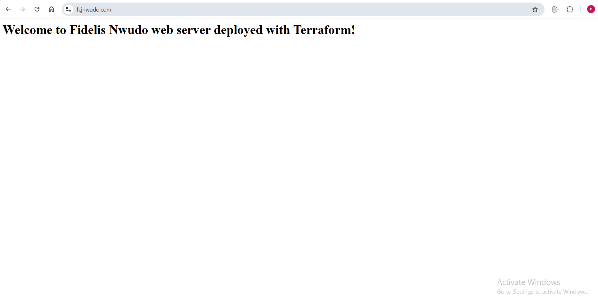

# AWS Load-Balanced EC2 Infrastructure with Terraform

This project provisions a fully functional, scalable AWS web infrastructure using Terraform. It includes a VPC, public/private subnets, an Application Load Balancer (ALB), Auto Scaling Group (ASG), Launch Template, EC2 instances, and HTTPS termination with ACM.

# Architecture Overview

The infrastructure deployed includes:

## Networking
- VPC (10.0.0.0/16)
- Two public subnets across different AZs
- Two private subnets
- Internet Gateway (IGW)
- Public Route Table
- Automatic association for public subnets

## Compute & Scaling
- Launch Template (Amazon Linux 2)
- User data installs and configures Apache (HTTPD)
- Autoscaling Group
 - Min: 2
 - Max: 3
 - Desired: 2

## Load Balancing
- Application Load Balancer (ALB)
- HTTPS Listener (443)
- Forwarding to EC2 Target Group

## Security
- ALB Security Group
 - Allow inbound HTTPS from 0.0.0.0/0
- EC2 Security Group
 - Only allow inbound traffic from the ALB SG
- Full outbound allowed

## DNS
- Route53 A Record
- ALB alias mapping

## Storage (Remote State)
- S3 backend (store .tfstate)

# How to Deploy
## Initialize Terraform
terraform init

## Validate configuration
terraform validate

## Preview changes
terraform plan

## Apply configuration
terraform apply

## Fully working HTTPS website

